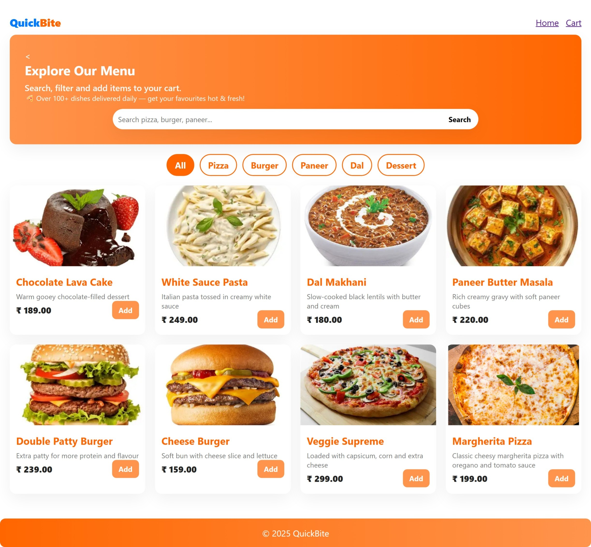
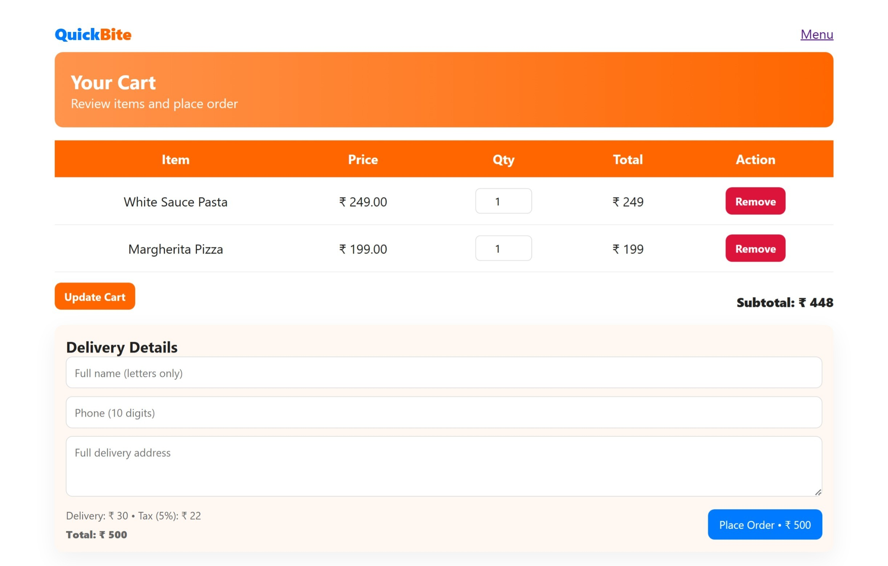
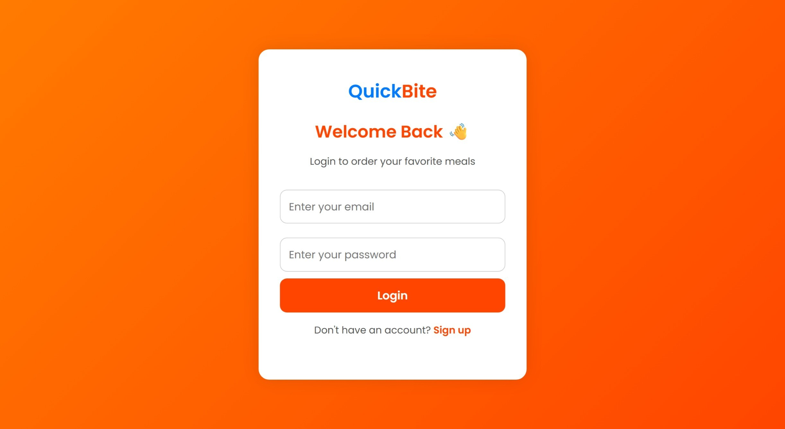
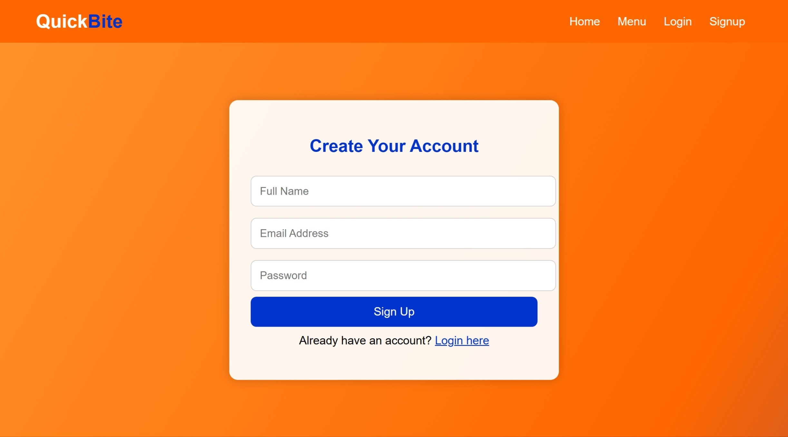
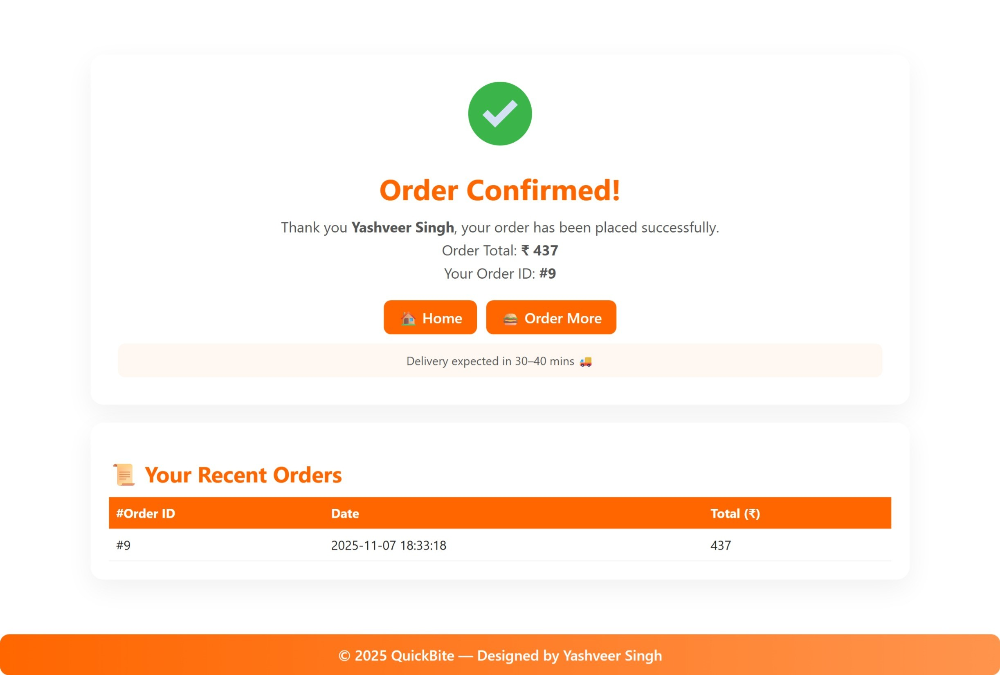

QuickBite - Online Food Ordering System (BCA Project)
Prepared By : Yashveer Singh

Files included:
- PHP source files (.php)
- assets/ (css, js, images)
- admin/ (admin panel files)
- food_db.sql (database schema + sample data)

# QuickBite 🍔
A responsive online food ordering system built with PHP, MySQL, HTML, CSS, and JavaScript.  
Users can sign up, log in, browse the menu, and place food orders easily.

## Features
- User authentication (Signup / Login)
- Menu browsing and ordering system
- Cart management
- Database integration with MySQL
- Vibrant UI inspired by Swiggy

## Tech Stack
- Frontend: HTML, CSS, JavaScript
- Backend: PHP
- Database: MySQL
- Server: XAMPP / Apache

## 🛠 How to Run Locally
1. Download or clone this repository  
2. Move it to C:\xampp\htdocs  
3. Start Apache and MySQL from XAMPP  
4. Import food_db.sql into phpMyAdmin  
5. Visit [http://localhost/QuickBite_Project](http://localhost/QuickBite_Project)

---

## 🍴 QuickBite Project Screenshots

### 🏠 Home Page  

### 🍕 Menu Page  

### 🛒 Cart Page  

### 🔐 Login Page  

### 🧾 Sign Up Page  

### ✅ Checkout Page  

---

### 📜 License
This project is protected under the *QuickBite Project License © 2025 Yashveer Singh*.  
Use of this source code is allowed *only for educational and personal learning purposes*.  
Commercial use or redistribution without permission is *strictly prohibited*.